# Hard Attention

An image is scanned via small patches (glimpses) to perform classification. Inspired by “Recurrent Models of Visual Attention” http://arxiv.org/abs/1406.6247 (RAM), however different model is used.

The differences:

1) No glimpse network, glimpse is a single patch (4x4), instead a collection of multiple resolution patches as in RAM

2) Actions, saccades, are discrete: move up, up-right, right, down-right, down, down-left, left from the current location. RAM actions are locations of patches.

3) Additional network is used to identify initial location from where glimpses start. The location network receives downsized image as input.

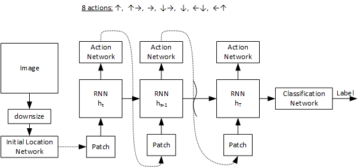

Action and Initial Location networks are trained by REINFORCE. The reward with class probability value as a reward.

## Results of training on MNIST
20 glimpses of 4x4 size with action step size 2, 10 epochs
train – 97.48%, test – 95.56%

Interesting enough, in many cases learned trajectories (saccades) reproduce the form of digits:

 |Images
---|---
original image|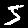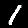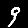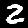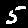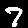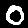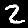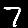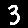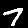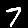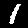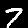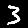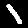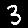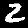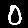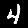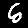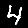
saccades (gray)|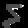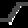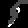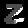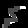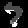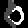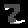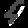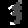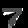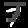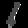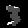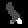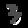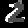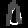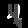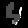

### The model parameters
#### RNN
LSTM, one layer of 512 cells

#### Action Network
1 hidden layer with 512 neurons + soft max + stochastic multinomial module

#### Initial Location Network
one layer, 4 x downsized input, soft max + stochastic multinomial module that outputs location coordinates

#### Regularization
All networks use dropout 0.7. The dropout is essential for network stability and allows finding better action policies.
